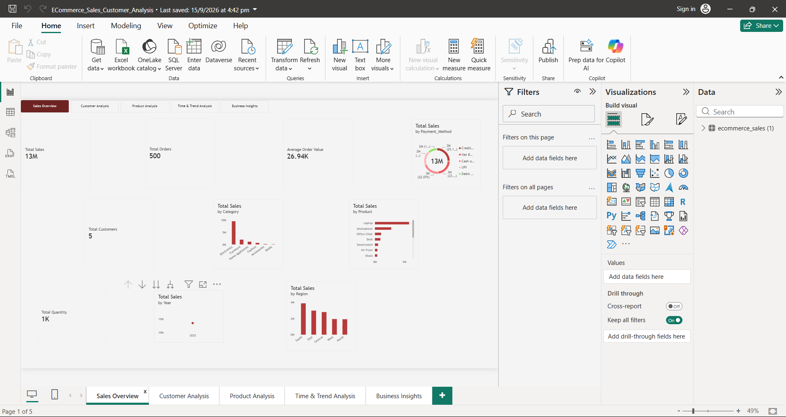
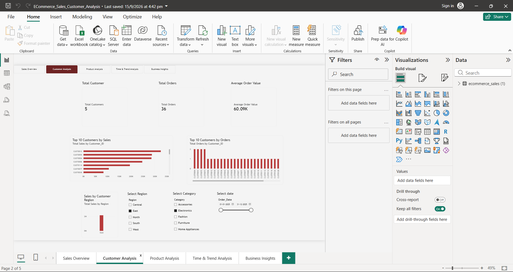
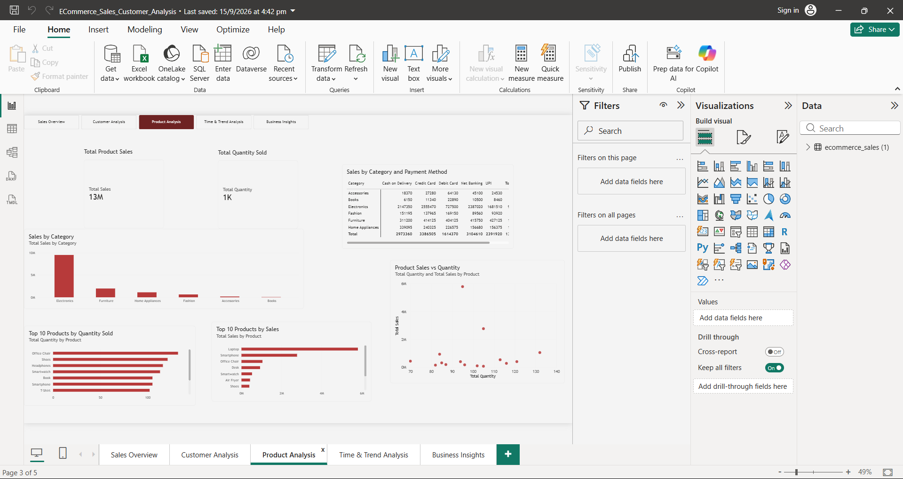
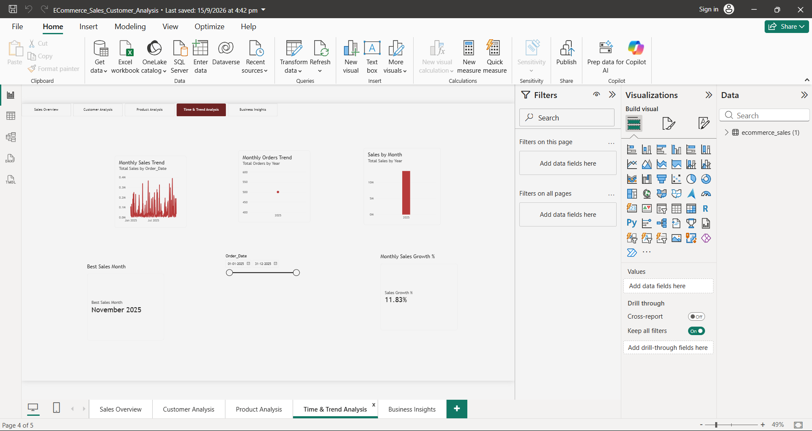
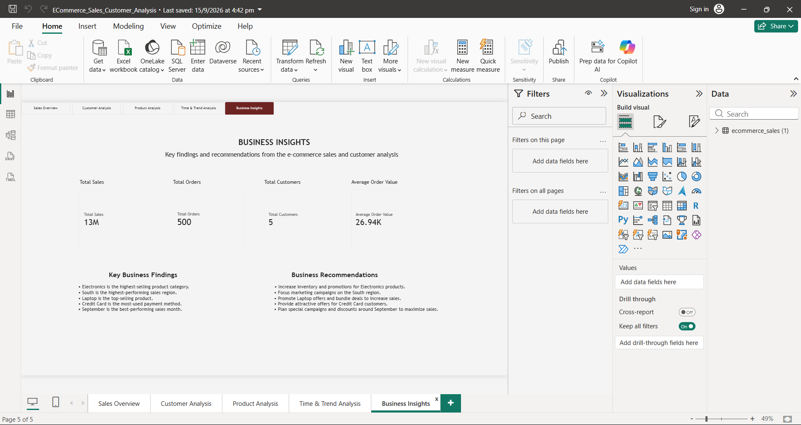

# E-Commerce Sales & Customer Analysis

## 📊 Project Overview

E-Commerce Sales & Customer Analysis is a Power BI data analytics project developed to analyze e-commerce sales, customers, products, regions, payment methods, and time-based sales trends.

The project transforms raw e-commerce transaction data into interactive dashboards and business insights using Power BI and DAX.

## 🎯 Objectives

- Analyze overall e-commerce sales performance
- Understand customer distribution
- Identify high-performing product categories
- Analyze sales across different regions
- Identify top-selling products
- Analyze payment methods
- Study sales trends over time
- Generate business insights for decision-making

## 🛠️ Tools & Technologies

- Power BI
- DAX
- Microsoft Excel / CSV
- Data Visualization
- Jira
- GitHub

## 📁 Project Structure

- `README.md` – Project overview and documentation
- `Project_Summary.txt` – Project summary
- `DAX_Measures.txt` – DAX measures used in the analysis
- `Business_Insights.txt` – Key findings and recommendations
- `1_Sales_Overview.png` – Sales Overview dashboard
- `2_Customer_Analysis.png` – Customer Analysis dashboard
- `3_Product_Analysis.png` – Product Analysis dashboard
- `4_Time_Trend_Analysis.png` – Time & Trend Analysis dashboard
- `5_Business_Insights.png` – Business Insights dashboard

## 📈 Dashboard Pages

### 1. Sales Overview
Provides an overview of sales, orders, customers, quantity, and average order value.

### 2. Customer Analysis
Analyzes customers and their distribution across regions.

### 3. Product Analysis
Analyzes product performance, including top products and quantity sold.

### 4. Time & Trend Analysis
Analyzes sales trends over time and identifies important sales periods.

### 5. Business Insights
Summarizes important findings and recommendations from the analysis.

## 🔑 Key Business Insights

- Electronics is the highest-selling product category.
- South is the highest-performing sales region.
- Laptop is the top-selling product.
- Credit Card is the most-used payment method.
- September is the best-performing sales month.

## 📊 Key KPIs

The dashboard includes:

- Total Sales
- Total Orders
- Total Customers
- Total Quantity
- Average Order Value

## 📷 Dashboard Preview

### Sales Overview

### Customer Analysis

### Product Analysis

### Time & Trend Analysis

### Business Insights

## 💡 Business Value

The analysis helps identify sales patterns, customer distribution, product performance, regional performance, payment preferences, and important sales periods that can support business planning and decision-making.

## 👩‍💻 Author

Dipali Gutte

Aspiring Data Analyst

Skills: Python, SQL, Excel, Power BI, Data Analysis, Data Visualization
